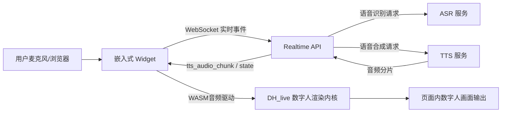

# 数字人语音交互系统技术概要（甲方版）

**文档日期：** 2026-03-06  
**适用对象：** 甲方技术评审、项目管理与运维团队  
**文档定位：** 说明当前可交付版本的技术方案、部署形态、运行机制与验收口径  

---

## 1. 项目目标与交付范围

本项目交付的是一套可嵌入任意网站的“实时语音数字人交互系统”，支持用户语音输入、系统语音输出、数字人口型联动以及全双工打断控制。

本阶段交付重点如下：

1. 提供可嵌入式前端数字人组件（Widget），支持拖拽与快速集成。
2. 提供实时会话服务，支持语音流式交互与状态同步。
3. 提供语音合成服务，支持默认中文女声与可切换音色能力。
4. 提供数字人渲染引擎（WebGL + WASM）实现口型联动。
5. 提供容器化部署方式与线上运维基础能力。

本阶段不在本概要中展开业务语义生成部分，仅覆盖语音链路与数字人呈现能力。

---

## 2. 总体技术架构

系统采用“前端渲染 + 后端实时编排 + 语音服务”三层结构。



### 2.1 架构特性

1. **全双工交互：** 用户发言可即时打断系统播报（barge-in）。
2. **低耦合部署：** 前端、实时服务、语音服务可独立扩缩容。
3. **可嵌入集成：** 通过 JS 挂载接口接入现有业务站点。
4. **可回退机制：** 若高阶渲染不可用，自动回退基础口型渲染，保障可用性。

---

## 3. 核心模块说明

## 3.1 前端嵌入组件（Widget）

前端组件以浏览器原生 JS 方式运行，支持：

1. 页面内浮层挂载与拖拽定位。
2. 麦克风采集、语音分段与静音收尾。
3. WebSocket 实时收发事件（状态、文本、音频分片）。
4. 语音播放与数字人口型联动。

典型挂载方式（示例）：

```html
<script type="module">
  import '/widget/index.js'
  window.DigitalHumanWidget.mount({
    serverUrl: 'https://your-domain',
    avatarRenderer: 'dh_live',
    voiceProfile: 'default_female_zh',
    draggable: true
  })
</script>
```

## 3.2 实时会话服务（Realtime API）

实时服务负责交互编排，不做前端渲染。主要职责：

1. 管理 WebSocket 会话生命周期。
2. 接收语音分段并触发识别。
3. 接收识别文本并进入后续语音回复流程。
4. 下发状态事件（`listening / thinking / speaking / idle`）。
5. 将 TTS 音频以分片事件下发至前端。
6. 处理中断事件，保证交互状态一致性。

## 3.3 语音合成服务（Local TTS）

语音合成服务采用独立容器部署，支持：

1. 默认中文女声在线合成。
2. 通过 `voice_profile_id` 进行音色切换。
3. 为克隆音色扩展预留配置入口（模型/音色文件可热切换）。
4. 健康探针与可观测字段输出（provider/version）。

## 3.4 数字人渲染内核（DH_live）

渲染层采用 `DHLiveMini.wasm + WebGL2` 的方式，在浏览器侧实时执行：

1. 加载角色视频素材与人脸几何数据（`01.mp4 + combined_data`）。
2. 接收语音 PCM/WAV 数据并写入 wasm 缓冲区。
3. 每帧更新 blendshape 参数并融合回原始角色画面。
4. 输出“画面内口型联动”效果，避免独立口型条的割裂感。

渲染失败时自动降级到图片口型模式，确保业务连续运行。

---

## 4. 实时交互流程（语音到数字人）

1. 用户点击开始后，Widget 开启麦克风采集。  
2. 前端基于 VAD 判定语音段落并提交 `audio_commit`。  
3. Realtime API 完成语音识别与会话编排，返回状态与文本事件。  
4. TTS 服务生成音频分片，Realtime API 持续下发 `tts_audio_chunk`。  
5. 前端边播音频边把音频数据喂给 DH_live 渲染内核，实现口型同步。  
6. 用户中途说话触发 `barge_in`，前端立即停播并回到监听态。  

---

## 5. 部署与运行方案

## 5.1 容器化部署

当前采用 Docker Compose 管理核心服务：

1. `realtime-api`：对外提供 `8090`（Web/API/静态资源）。
2. `local-tts`：对外提供 `8091`（TTS 能力与健康检查）。

## 5.2 资源组织

1. Widget 静态资源：`/widget/*`
2. 数字人渲染资源：`/widget/dh-live/*`
3. 角色素材资源：`/widget/dh-live/assets/default/*`

## 5.3 发布机制

采用“本地构建 + Bundle 增量更新 + 服务器重启验证”流程：

1. 本地代码提交并推送。
2. 通过 `git bundle` 上传服务器进行受控更新。
3. 前端 `dist` 本地构建后上传，避免服务器高负载构建。
4. 服务容器重建并执行健康检查与关键静态资源可达性检查。

---

## 6. 运维与稳定性设计

## 6.1 健康检查

1. `GET /health`（realtime-api）
2. `GET :8091/health`（local-tts）

## 6.2 容错与降级

1. 识别空结果不会中断会话，可继续下一轮输入。
2. 渲染器初始化失败自动回退基础模式。
3. 中断信号与播放状态解耦，避免“状态卡 speaking”。

## 6.3 可观测建议

建议在生产环境增加以下监控：

1. 会话成功率（WebSocket 建连成功率）。
2. 首包时延（首条音频分片到达时间）。
3. 端到端轮次耗时（用户结束说话到系统播报开始）。
4. 渲染异常率（DH_live 初始化失败占比）。

---

## 7. 安全与合规建议

1. 生产环境统一启用 HTTPS/WSS，保障语音传输安全。
2. 麦克风权限采用浏览器原生授权，不做静默采集。
3. 音频缓存仅保留会话必要周期，避免长期落盘。
4. 服务器访问控制建议基于白名单与反向代理限流。

---

## 8. 验收口径（建议版）

建议甲方按以下维度验收：

1. **可用性：** 页面加载后可正常打开组件并开始语音交互。
2. **实时性：** 用户说话可触发响应，支持中途打断重说。
3. **一致性：** 状态机在监听/思考/播报/空闲间切换正确。
4. **呈现效果：** 播报时人物口型随语音变化，停止后恢复自然态。
5. **部署性：** 服务重启后恢复正常，健康检查与关键资源可访问。

---

## 9. 后续演进建议

1. 增加多角色素材管理后台（角色包上传、版本切换、灰度发布）。
2. 增加克隆音色管理接口（音色注册、质检、授权策略）。
3. 增加会话追踪与告警面板（时延、失败、重试统计）。
4. 推进移动端专项优化（低端设备帧率与功耗控制）。

---

## 10. 结论

当前交付版本已形成完整的“语音输入 - 语音输出 - 数字人口型联动”闭环能力，具备网页嵌入、容器化部署、全双工打断与可回退容错机制。  
该方案可直接支撑甲方一期上线，并为后续角色扩展、音色扩展与运维平台化预留了标准接口与工程结构。
